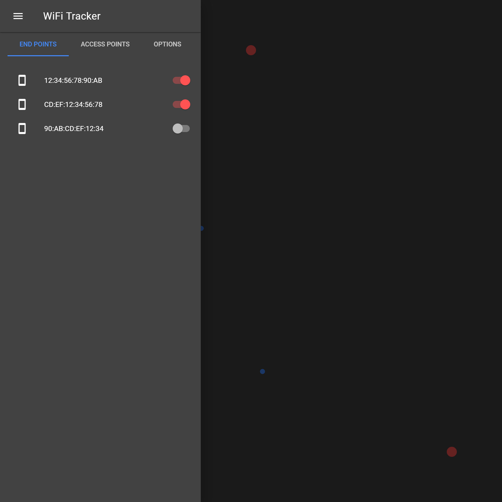

# WiFi Tracker
An application to use multiple ESP32 as a tracking system for WiFi devices nearby.

The project is divided into two sub projects:
- The ESP32 Firmware to detect WiFi devices nearby.
- The User Interface to visualize the tracked devices.

## ESP32 Firmware
The firmware for the ESP32 Micro Controller is described in details [here](./firmware/README.md).

## The User Interface
The User Interface to visualize the tracked devices is described in details [here](./ui/README.md).

A live demo of the UI can be found [here](https://wifi.primbs.dev/) (Google Chrome required for WebBluetooth API).

