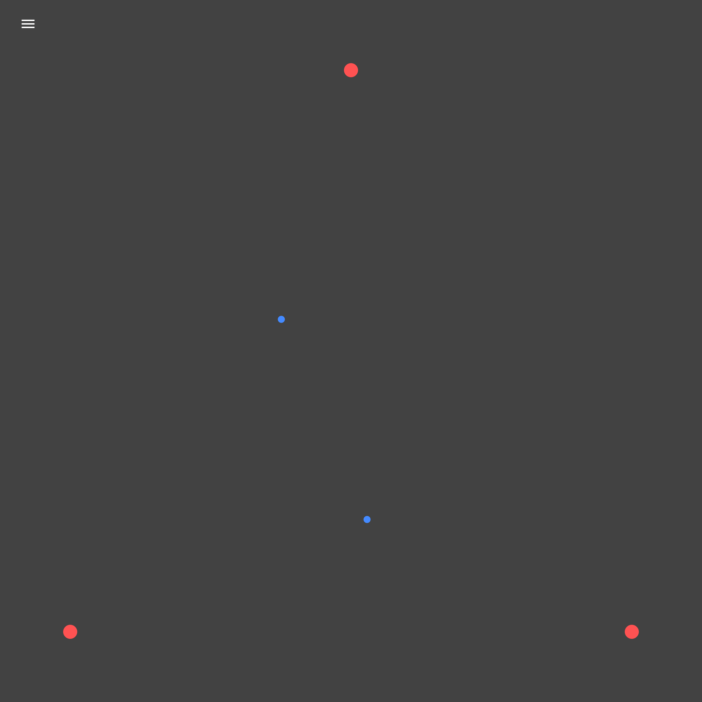
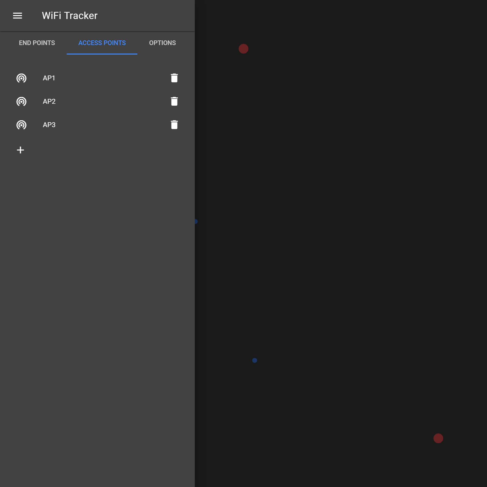
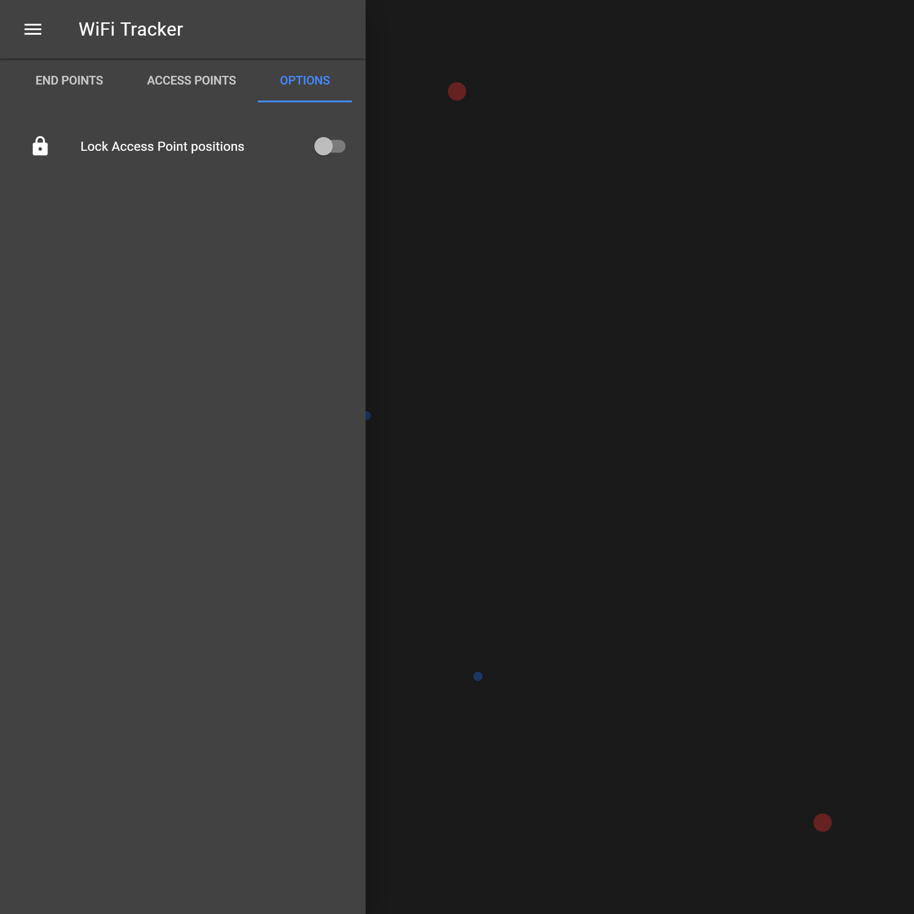

# WiFi Tracker User Interface
This sub project is a User Interface to visualize tracked WiFi devices. It is a Progressive Web App (PWA) using Vue.js.

## Demo
A live demo of the User Interface is available [here](https://wifi.primbs.dev/).


 on the map.")



## Project setup
To compile the User Interface, Node.js is required to be installed on your computer. To install the necessary
dependencies, navigate to *[parent-directory]/ui/src* and run
```
npm install
```
There are also other options available:

### Compile and hot-reload for development
```
npm run serve
```

### Compile and minify for production
```
npm run build
```

### Run test
```
npm run test
```

### Lint and fix files
```
npm run lint
```
